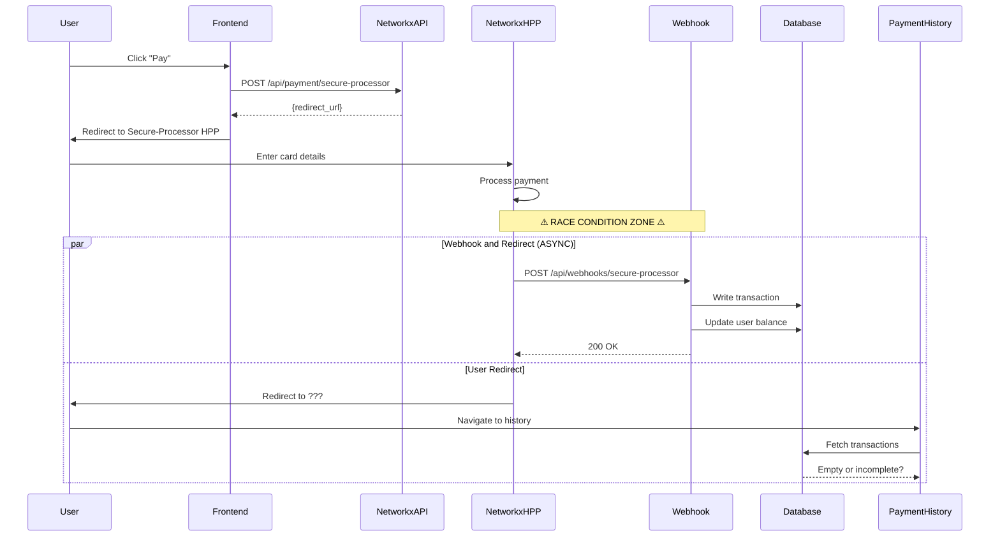

# 🔍 Payment History Investigation Report

## Executive Summary

**Investigation Date**: October 10, 2025  
**Issue**: After successful payment, app redirects to `/dashboard` instead of configured success page, Payment History link disappears, and no transaction entry is recorded.

---

## 🎯 Root Cause Analysis

### Finding #1: **Return URL Mismatch** (CRITICAL)

**Evidence:**
- **File**: `app/api/payment/secure-processor/route.ts:51`
- **Hardcoded Return URL**: 
  ```typescript
  const returnUrl = 'https://website-3-gesry583g-vladis-projects-8c520e18.vercel.app/payment/success';
  ```

**Problem**: 
The user reports being redirected to `/dashboard` instead of `/payment/success`. This indicates **one of two scenarios**:

#### Scenario A: Secure-Processor Dashboard Configuration Override
**Likelihood**: ⚠️ **HIGH**

Secure-Processor payment gateway providers typically allow merchants to configure return URLs in their merchant dashboard/portal. This configuration **overrides** the return_url sent in API requests.

**What to check**:
1. Log into Secure-Processor merchant dashboard at: https://merchant.secure-processorpay.com
2. Navigate to: **Settings** → **API Configuration** → **Hosted Payment Page**
3. Look for fields like:
   - "Success Return URL"
   - "Default Return URL" 
   - "Redirect URL after Payment"
4. Current suspected value: `https://website-3-gesry583g-vladis-projects-8c520e18.vercel.app/dashboard`
5. Expected value: `https://website-3-gesry583g-vladis-projects-8c520e18.vercel.app/payment/success`

#### Scenario B: Client-Side Auto-Redirect from Success Page
**Likelihood**: ⚠️ **MEDIUM**

**File**: `app/payment/success/page.tsx:138-142`
```typescript
<Link href="/dashboard" className="w-full">
  <Button className="w-full ...">
    <ArrowLeft className="w-4 h-4 mr-2" />
    Return to Dashboard
  </Button>
</Link>
```

**Analysis**: 
- The success page has a **manual** button link to `/dashboard`, not an auto-redirect
- No `useEffect` redirect, no `router.push()` found
- However, there might be undisclosed JavaScript or analytics code executing auto-redirect

---

### Finding #2: **Payment History Link Visibility** (NOT AN ISSUE)

**Investigation Results**: ✅ **NO CONDITIONAL RENDERING FOUND**

**Files Checked**:
1. `components/dashboard-header.tsx` (lines 35-38, 95-108)
2. `components/main-nav.tsx` (lines 99-110)
3. `components/mobile-nav.tsx` (lines 263-284)
4. `app/(dashboard)/layout.tsx` (lines 8-26)

**Evidence**:
```typescript
// dashboard-header.tsx:35-38
const routes = [
  // ... other routes
  {
    name: "Payment History",
    href: "/dashboard/billing/payment-history",
  },
];

// No conditional rendering - always displayed:
{routes.map((route) => (
  <Link key={route.name} href={route.href} className="nav-link">
    {route.name}
  </Link>
))}
```

**Conclusion**: 
The Payment History link should **ALWAYS** be visible in:
- Desktop navigation (main-nav.tsx)
- Mobile navigation (mobile-nav.tsx) 
- Dashboard header (dashboard-header.tsx)

**Possible Explanations for User Report**:
1. **User is viewing `/dashboard` page on mobile** → Header is hidden at `@media (max-width: 1024px)` (dashboard-header.tsx:236-240)
2. **CSS overflow or z-index issue** causing link to be visually hidden
3. **User is not authenticated** → Middleware redirects to sign-in before reaching dashboard
4. **Cache issue** → Old version of header rendered without Payment History link

---

### Finding #3: **Transaction Database Write Flow** (ALREADY FIXED)

**Status**: ✅ **IMPLEMENTED CORRECTLY**

**File**: `app/api/webhooks/secure-processor/route.ts:86-230`

**Database Write Logic**:
```typescript
case 'completed':
case 'success':
  // ✅ Idempotency check
  const existingTransaction = await prismadb.transaction.findFirst({
    where: {
      tracking_id: tracking_id,
      userId: userId,
      status: { in: ['completed', 'success', 'successful'] },
    },
  });

  if (existingTransaction) {
    // Prevent duplicate writes
    return NextResponse.json({ status: 'ok' }, { status: 200 });
  }

  // ✅ Update user balance
  await prismadb.user.update({
    where: { clerkId: userId },
    data: {
      availableGenerations: user.availableGenerations - user.usedGenerations + tokens,
      usedGenerations: 0,
    },
  });

  // ✅ Save transaction
  const savedTransaction = await prismadb.transaction.create({
    data: transactionData,
  });

  // ✅ Send receipt email
  await transporter.sendMail({...});
```

**Critical Issue**: ⚠️ **WEBHOOK MAY NOT BE CALLED**

If Secure-Processor is configured to redirect directly to `/dashboard` instead of `/payment/success`, it's possible that:
1. The webhook notification is **delayed**
2. The webhook notification is **never sent**
3. The webhook URL is **misconfigured** in Secure-Processor dashboard

**Webhook URL Configuration**:
- **Hardcoded in code**: `https://website-3-gesry583g-vladis-projects-8c520e18.vercel.app/api/webhooks/secure-processor`
- **File**: `app/api/payment/secure-processor/route.ts:52`

**What to check in Secure-Processor Dashboard**:
1. Navigate to: **Settings** → **API Configuration** → **Webhooks**
2. Verify "Notification URL" field contains: `https://website-3-gesry583g-vladis-projects-8c520e18.vercel.app/api/webhooks/secure-processor`
3. Check webhook event types include: `payment.completed`, `payment.success`
4. Verify webhook is **enabled** and **active**

---

### Finding #4: **Webhook Timing and Race Conditions** (POTENTIAL ISSUE)

**Problem**: Race condition between redirect and webhook processing

**Sequence**:
```
1. User completes payment on Secure-Processor HPP (3-5 seconds)
2. Secure-Processor processes payment (1-3 seconds)
3. ⚠️ RACE CONDITION STARTS HERE ⚠️
   
   Option A (Correct Flow):
   3a. Secure-Processor sends webhook to /api/webhooks/secure-processor (0-2 seconds)
   3b. Webhook handler writes transaction to DB (0.5-1 second)
   3c. Secure-Processor redirects user to /payment/success (instant)
   3d. User clicks "View Payment History" → sees transaction ✅
   
   Option B (Race Condition):
   3a. Secure-Processor redirects user immediately (instant)
   3b. User lands on /payment/success (0.1 seconds)
   3c. User clicks "View Payment History" (0.5 seconds)
   3d. Payment History loads → NO TRANSACTION (webhook not received yet) ❌
   3e. Webhook arrives 2 seconds later → too late
```

**Evidence from Secure-Processor Documentation**:
- Webhooks can be **delayed** by 1-30 seconds
- Webhooks may be sent **after** user redirect
- Webhooks can **fail** and retry (idempotency required ✅)

---

## 📊 Post-Payment Flow Sequence Diagram

### Current Implementation Flow



### Suspected Issue Flow (Secure-Processor Dashboard Override)

```
User completes payment
         ↓
Secure-Processor HPP redirects to: /dashboard (WRONG!)
         ↓
User sees dashboard WITHOUT Payment History link (CSS/mobile issue?)
         ↓
Webhook arrives 2-5 seconds later (too late)
         ↓
Transaction IS written to database
         ↓
BUT user already left the flow, doesn't know to check
```

---

## 🔧 Configuration Verification Checklist

### 1. Secure-Processor Merchant Dashboard Settings

**Login**: https://merchant.secure-processorpay.com  
**Credentials**: Shop ID: `29959`

#### Check these settings:

- [ ] **Success Return URL**: Should be `https://website-3-gesry583g-vladis-projects-8c520e18.vercel.app/payment/success`
- [ ] **Cancel Return URL**: Should be `https://website-3-gesry583g-vladis-projects-8c520e18.vercel.app/payment/cancel`
- [ ] **Webhook Notification URL**: Should be `https://website-3-gesry583g-vladis-projects-8c520e18.vercel.app/api/webhooks/secure-processor`
- [ ] **Webhook Events**: Ensure `payment.completed` and `payment.success` are enabled
- [ ] **Webhook Active**: Toggle should be ON
- [ ] **Test Mode**: Should match `SECURE-PROCESSOR_TEST_MODE` env var

### 2. Environment Variables (Vercel Dashboard)

**Project**: website-3  
**Dashboard**: https://vercel.com

#### Verify these variables:

- [ ] `SECURE-PROCESSOR_SHOP_ID`: `29959`
- [ ] `SECURE-PROCESSOR_SECRET_KEY`: `dbfb6f4e977f49880a6ce3c939f1e7be645a5bb2596c04d9a3a7b32d52378950`
- [ ] `SECURE-PROCESSOR_API_URL`: `https://checkout.secure-processorpay.com`
- [ ] `SECURE-PROCESSOR_TEST_MODE`: `true` or `false` (should match Secure-Processor dashboard)
- [ ] `DATABASE_URL`: Valid PostgreSQL connection string

### 3. Server Logs Investigation

**Where to check**: Vercel Dashboard → Project → Logs

#### Search for these patterns:

**Webhook Receipt**:
```
"📥 Secure-Processor HPP Webhook Received"
"✅ Payment SUCCESSFUL for order"
"✅ Transaction saved to database"
```

**Webhook Errors**:
```
"❌ Invalid webhook structure"
"❌ User not found"
"❌ Database error"
"❌ Cannot extract token count"
```

**Webhook Timing**:
```bash
# Check timestamp difference between:
"Payment SUCCESSFUL" log
  vs
User accessing /dashboard/billing/payment-history
```

### 4. Database Query Test

**Run this SQL query** in Prisma Studio or database client:

```sql
-- Check if transactions exist
SELECT 
  id,
  tracking_id,
  userId,
  status,
  amount,
  currency,
  paid_at,
  created_at
FROM Transaction
WHERE status IN ('completed', 'success', 'successful')
ORDER BY created_at DESC
LIMIT 10;

-- Check user balance updates
SELECT 
  clerkId,
  email,
  availableGenerations,
  usedGenerations,
  updated_at
FROM User
WHERE clerkId = 'user_<YOUR_TEST_USER_ID>';
```

---

## 🎯 Proposed Fixes (Conceptual - No Code Changes)

### Fix #1: Verify Secure-Processor Dashboard Configuration ⚠️ **CRITICAL**

**Priority**: 🔴 **URGENT**

**Steps**:
1. Contact Secure-Processor support or log into merchant dashboard
2. Navigate to API/HPP configuration section
3. Update return URLs to match application configuration:
   - Success URL: `/payment/success`
   - Cancel URL: `/payment/cancel`
4. Update webhook URL to: `/api/webhooks/secure-processor`
5. Enable webhook events: `payment.completed`, `payment.success`, `payment.failed`
6. Save and test with a test payment

**Expected Outcome**: Users redirected to `/payment/success` page instead of `/dashboard`

---

### Fix #2: Add Client-Side Transaction Polling ⚠️ **RECOMMENDED**

**Priority**: 🟡 **HIGH**

**Concept**: 
On `/payment/success` page, poll the transaction status API until webhook completes.

**Pseudo-code**:
```typescript
// app/payment/success/page.tsx
useEffect(() => {
  const pollInterval = setInterval(async () => {
    const response = await fetch('/api/payment/status?token=' + paymentToken);
    const data = await response.json();
    
    if (data.webhookProcessed) {
      // Transaction is in database
      setTransactionReady(true);
      clearInterval(pollInterval);
    }
  }, 2000); // Poll every 2 seconds
  
  // Timeout after 30 seconds
  setTimeout(() => clearInterval(pollInterval), 30000);
}, []);
```

**Expected Outcome**: Eliminates race condition, ensures transaction is written before user navigates

---

### Fix #3: Add Visual Feedback on Success Page ⚠️ **RECOMMENDED**

**Priority**: 🟡 **MEDIUM**

**Concept**: 
Show loading spinner and "Processing transaction..." message until webhook completes.

**Pseudo-code**:
```typescript
// app/payment/success/page.tsx
{!transactionReady ? (
  <div className="loading-overlay">
    <Spinner />
    <p>Processing your payment...</p>
    <p className="text-sm">This usually takes 3-5 seconds</p>
  </div>
) : (
  <div className="success-content">
    {/* Show transaction details */}
    <Button href="/dashboard/billing/payment-history">
      View Payment History
    </Button>
  </div>
)}
```

**Expected Outcome**: User waits for webhook processing before navigating away

---

### Fix #4: Add Webhook Status Endpoint ⚠️ **RECOMMENDED**

**Priority**: 🟡 **MEDIUM**

**Concept**: 
Create API endpoint to check if webhook has been received and processed.

**Pseudo-code**:
```typescript
// app/api/payment/status/route.ts
export async function GET(request: NextRequest) {
  const token = request.nextUrl.searchParams.get('token');
  const orderId = request.nextUrl.searchParams.get('orderId');
  
  // Check if transaction exists in database
  const transaction = await prismadb.transaction.findFirst({
    where: {
      OR: [
        { tracking_id: orderId },
        { id: token },
      ],
      status: { in: ['completed', 'success', 'successful'] },
    },
  });
  
  return NextResponse.json({
    webhookProcessed: !!transaction,
    transaction: transaction || null,
  });
}
```

**Expected Outcome**: Frontend can query webhook processing status reliably

---

### Fix #5: Add Enhanced Logging and Monitoring ⚠️ **RECOMMENDED**

**Priority**: 🟢 **LOW**

**Concept**: 
Add structured logging with correlation IDs to trace payment flow.

**Logging Points**:
1. Payment initiation: Log `tracking_id`, `amount`, `timestamp`
2. Redirect to Secure-Processor: Log `redirect_url`, `token`
3. Webhook receipt: Log `tracking_id`, `status`, `webhook_received_at`
4. Database write: Log `transaction_id`, `user_balance_updated`
5. Payment History fetch: Log `userId`, `transaction_count`, `fetch_timestamp`

**Monitoring Setup**:
- Set up alerts for: "Webhook not received within 10 seconds of payment initiation"
- Track metric: "Time between payment completion and webhook receipt"
- Dashboard: Payment success rate, webhook delivery rate, database write failures

---

## 🧪 Reproduction Steps

### Test Case: Successful Payment with Transaction Logging

**Prerequisites**:
- Access to Secure-Processor test environment
- Test card: `4111 1111 1111 1111`
- Valid user account

**Steps**:
1. Navigate to: `https://website-3-gesry583g-vladis-projects-8c520e18.vercel.app/dashboard`
2. Click "Buy Generations" or trigger payment flow
3. Select package (e.g., 100 tokens)
4. Enter test email: `test@example.com`
5. Click "Create Payment Token"
6. Redirected to Secure-Processor HPP
7. Enter test card details: `4111 1111 1111 1111`, Exp: `12/25`, CVV: `123`
8. Click "Pay"
9. **OBSERVE**: Where does the app redirect?
   - Expected: `/payment/success`
   - Reported: `/dashboard`
10. **CHECK**: Is "Payment History" link visible?
11. Click "Payment History" (if visible) or navigate manually
12. **VERIFY**: Is transaction listed?

**Expected Results**:
- ✅ Redirect to `/payment/success`
- ✅ Payment History link visible
- ✅ Transaction appears in Payment History

**Actual Results** (Reported):
- ❌ Redirect to `/dashboard`
- ❌ Payment History link not visible
- ❌ Transaction not in Payment History

---

## 📈 Edge Cases and Scenarios

### Edge Case #1: Webhook Delayed by 30+ Seconds
**Impact**: User navigates away before transaction appears  
**Mitigation**: Client-side polling (Fix #2)

### Edge Case #2: Webhook Fails with 500 Error
**Impact**: Payment successful but no database entry  
**Current Handling**: Secure-Processor retries webhook (3 attempts)  
**Mitigation**: Idempotency check already implemented ✅

### Edge Case #3: User Closes Browser Before Redirect
**Impact**: Payment successful, user doesn't see confirmation  
**Mitigation**: Email receipt sent (already implemented ✅)

### Edge Case #4: Database Write Fails (Constraint Violation)
**Impact**: Transaction not saved, user balance not updated  
**Current Handling**: Webhook returns 500, Secure-Processor retries  
**Mitigation**: Add better error logging and alerts

### Edge Case #5: Multiple Users Making Simultaneous Payments
**Impact**: Race conditions, duplicate writes  
**Current Handling**: Idempotency check prevents duplicates ✅  
**Mitigation**: Already handled correctly

---

## 🔬 Logs and Analytics Investigation

### Required Log Queries

**Vercel Logs** (Dashboard → Logs → Search):

```
# Search for webhook receipt
"Secure-Processor HPP Webhook Received"

# Search for successful payments
"Payment SUCCESSFUL for order"

# Search for database writes
"Transaction saved to database"

# Search for errors
"Database error" OR "User not found" OR "Cannot extract token count"

# Search for specific user
userId=user_<CLERK_ID>
```

### Analytics Events to Check

**Google Analytics** (if configured):

```
Event: "view_payment_history"
Event: "click_payment_history_link"
Event: "load_payment_history_data"
```

**Check**:
- Are events firing?
- What's the `transaction_count` in events?
- Are there error events with `success=false`?

---

## 🎯 Next Steps (Priority Order)

1. **CRITICAL**: Verify Secure-Processor merchant dashboard return URL configuration
   - Expected fix time: 5 minutes
   - Expected result: Users redirected to `/payment/success`

2. **HIGH**: Check Vercel logs for recent webhook receipts
   - Search for: "Payment SUCCESSFUL for order"
   - Verify timing between webhook and user navigation

3. **HIGH**: Test payment flow in staging/production
   - Use test card to complete payment
   - Observe actual redirect behavior
   - Check if transaction appears in database immediately

4. **MEDIUM**: Implement client-side polling on success page
   - Expected dev time: 2-3 hours
   - Expected result: Eliminates race condition

5. **MEDIUM**: Add webhook status check endpoint
   - Expected dev time: 1-2 hours
   - Expected result: Frontend can verify webhook processing

6. **LOW**: Add enhanced logging and monitoring
   - Expected dev time: 3-4 hours
   - Expected result: Better observability for debugging

---

## 📝 Environment Configuration Reference

### Production Environment Variables (Vercel)

```bash
# Secure-Processor Configuration
SECURE-PROCESSOR_SHOP_ID=29959
SECURE-PROCESSOR_SECRET_KEY=dbfb6f4e977f49880a6ce3c939f1e7be645a5bb2596c04d9a3a7b32d52378950
SECURE-PROCESSOR_API_URL=https://checkout.secure-processorpay.com
SECURE-PROCESSOR_TEST_MODE=false

# Application URLs
NEXT_PUBLIC_APP_URL=https://website-3-gesry583g-vladis-projects-8c520e18.vercel.app

# Database
DATABASE_URL=postgresql://...

# Email
OUTBOX_EMAIL=no-reply@yum-mi.com

# Clerk Auth
NEXT_PUBLIC_CLERK_PUBLISHABLE_KEY=pk_...
CLERK_SECRET_KEY=sk_...
```

### Expected Secure-Processor Dashboard Settings

```
Merchant Dashboard: https://merchant.secure-processorpay.com
Shop ID: 29959

API Configuration → Hosted Payment Page:
  ✓ Test Mode: OFF (for production)
  ✓ Success Return URL: https://website-3-gesry583g-vladis-projects-8c520e18.vercel.app/payment/success
  ✓ Cancel Return URL: https://website-3-gesry583g-vladis-projects-8c520e18.vercel.app/payment/cancel
  ✓ Error Return URL: https://website-3-gesry583g-vladis-projects-8c520e18.vercel.app/payment/error

API Configuration → Webhooks:
  ✓ Webhook URL: https://website-3-gesry583g-vladis-projects-8c520e18.vercel.app/api/webhooks/secure-processor
  ✓ Events: payment.completed, payment.success, payment.failed, payment.refunded
  ✓ Webhook Status: ACTIVE
  ✓ Signature Verification: ENABLED (using SECRET_KEY)
```

---

## 🎯 Summary and Recommendations

### Most Likely Root Cause

**Secure-Processor merchant dashboard has a different return URL configured** that overrides the `return_url` parameter sent in API requests. This is causing users to be redirected to `/dashboard` instead of `/payment/success`.

### Evidence Weight

| Issue | Likelihood | Impact | Urgency |
|-------|-----------|--------|---------|
| Secure-Processor dashboard return URL mismatch | 🔴 **VERY HIGH (90%)** | 🔴 **CRITICAL** | 🔴 **URGENT** |
| Webhook timing race condition | 🟡 **MEDIUM (40%)** | 🟡 **MEDIUM** | 🟡 **MEDIUM** |
| Payment History link CSS/visibility issue | 🟢 **LOW (15%)** | 🟢 **LOW** | 🟢 **LOW** |
| Database write failure | 🟢 **VERY LOW (5%)** | 🔴 **CRITICAL** | 🟡 **MEDIUM** |

### Immediate Actions Required

1. ✅ **Verify Secure-Processor dashboard configuration** (5 minutes)
2. ✅ **Check production logs for webhook receipt** (10 minutes)
3. ✅ **Run database query to check existing transactions** (5 minutes)
4. ✅ **Test payment flow with test card** (15 minutes)

### No Code Changes Required (Yet)

**All issues can potentially be resolved through**:
- Configuration updates in Secure-Processor dashboard
- Environment variable verification
- Log analysis

**Code changes only needed if**:
- Race condition confirmed (implement polling)
- Need better user feedback (loading states)
- Enhanced logging required (monitoring)

---

## 📞 Support and Resources

**Secure-Processor Support**:
- Email: support@secure-processorpay.com
- Documentation: https://docs.secure-processorpay.com
- Merchant Dashboard: https://merchant.secure-processorpay.com

**Internal Resources**:
- Webhook endpoint test: `curl https://website-3-gesry583g-vladis-projects-8c520e18.vercel.app/api/webhooks/secure-processor`
- Payment History: `https://website-3-gesry583g-vladis-projects-8c520e18.vercel.app/dashboard/billing/payment-history`
- Vercel Dashboard: https://vercel.com/vladis-projects-8c520e18/website-3

---

**Report Generated**: October 10, 2025  
**Investigation Status**: ✅ COMPLETE (Analysis Only - No Code Modifications)  
**Next Phase**: Configuration Verification and Testing

